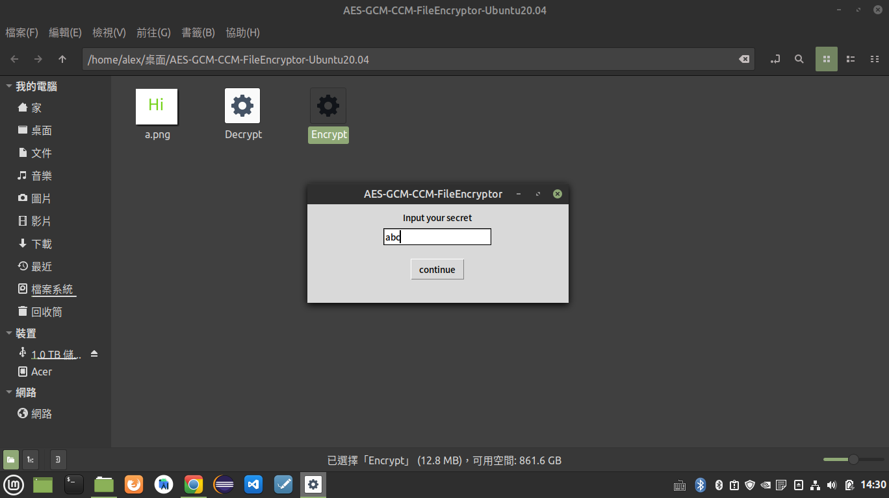
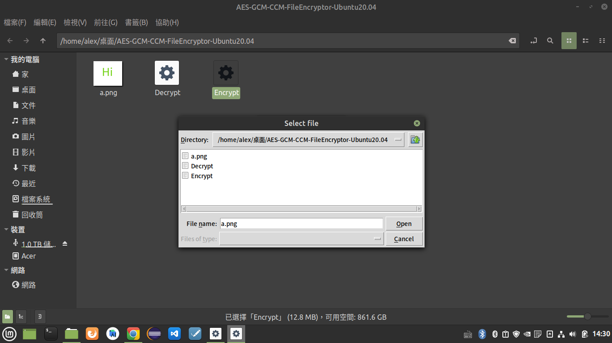

# AES-GCM-CCM-FileEncryptor
Encrypt your file by AES GCM or CCM,Made by 蕭維均.

# Enviroment requirement

## Ubuntu
Require PyCryptodome module
```
pip3 install -U PyCryptodome
```

## Windows

Require python3,MSVC v142 x64/x86 or MSVC v140 x64/x86

```
pip install pycryptodomex --no-binary :all:
pip install PyCryptodome
```

please read PyCryptodome official tutorial

[https://pycryptodome.readthedocs.io/en/latest/src/installation.html](https://pycryptodome.readthedocs.io/en/latest/src/installation.html)

# Run

After you have the python eviroment and PyCryptodome,you can run it.

### 1.Encrypt

```
python3 Encrypt.py
```

Choose GCM or CCM (Default GCM)

```
python3 Encrypt.py --GCM
```

```
python3 Encrypt.py --CCM
```
### 2.Decrypt

```
python3 Decrypt.py
```
Choose GCM or CCM (Default GCM)

```
python3 Decrypt.py --GCM
```

```
python3 Decrypt.py --CCM
```




# Download Source file

[DownloadSourceFIle](https://github.com/AlexTrinityBlock/AES-GCM-CCM-FileEncryptor/archive/refs/heads/master.zip)

# Download Binary

[Ubuntu20.04](https://github.com/AlexTrinityBlock/AES-GCM-CCM-FileEncryptor/raw/master/download/AES-GCM-CCM-FileEncryptor-Ubuntu20.04.zip) 